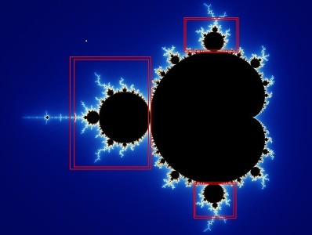

The Mandelbrot set is a mathematical phenomenon which proves graphically that iterative functions performed on complex numbers have fractal properties; They are self repeating, as can be seen in the areas highlighted below.

</img>

The Mandelbrot set can be generated using the complex iterative function z(n + 1) = z(n)^2 + c, where z(0) = 0, and both z and c are complex numbers. c is mapped to the screen coordinates such that each pixel gives a different value of c for a range of complex numbers. The smaller the range, the “closer” the mandelbrot appears. Based on the value of c and a maximum iteration count, the color of each pixel can be calculated based on the number of iterations the formula takes for the magnitude of z to become greater than 2.

A slight variation on the mandelbrot set, called the Julia set, can be generated by keeping c constant and mapping z(0) (The initial value of z) to the screen coordinates; Each value of c gives a different image. By smoothly generating the values of c you can come up with a pretty neat animation.

</img>

</img>

</img>
